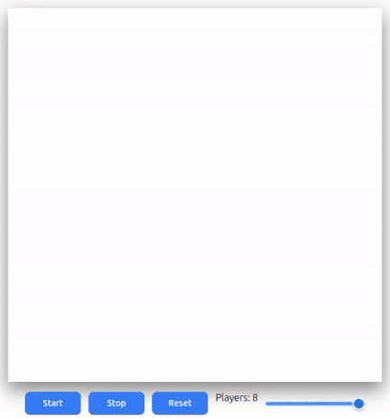

# 🧀🐭 Maze Race Game

A browser-based maze racing game where multiple mice compete to reach the cheese using different pathfinding strategies (DFS & BFS).

Built with **vanilla JavaScript**, HTML5 Canvas, and responsive UI design.

---

## 🎮 Features

- 🧩 Procedurally generated maze 
- 🐭 Multiple players (1–8) 
- 🧠 Mixed pathfinding strategies per player
  - Breadth-First Search (BFS)
  - Depth-First Search (DFS)
- 🎯 Smart entrance spawning system  
- 🧀 Central cheese objective  
- 🏆 Win screen with player color & medal  
- 📱 Fully responsive (mobile & desktop)
- 🔄 Instant restart without page reload
- 🧵 Smooth movement interpolation
- 🎨 Player trails with dynamic transparency

---

## 🖼 Previews

### 💻 Desktop


### 📱 Mobile


---

## 🏗 Project Structure

```
.
├── img
│   ├── desktop-preview.gif
│   └── mobile-preview.gif
├── index.html
├── js
│   ├── constants.js     # Global config & game constants
│   ├── game.js          # Main game engine & loop
│   ├── gamesupport.js   # Utility class (helpers)
│   ├── main.js          # Bootstrapping & wiring
│   ├── maze.js          # Maze generation & grid system
│   ├── pathfinding.js   # BFS & DFS algorithms
│   └── player.js        # Player logic & movement
├── LICENSE
├── README.md
└── style.css
```

---

## ⚙️ How It Works

### 🧱 Maze
- Grid-based structure  
- Each cell stores 4 walls  
- Movement checks walls, not coordinates  

### 🐭 Players
Each player has:
- Unique color  
- Randomized speed variation  
- Random pathfinding strategy  
- Entrance spawn location  

### 🧠 Pathfinding
Each round, players randomly use:

| Algorithm | Behavior |
|----------|----------|
| **BFS** | Shortest path, optimal |
| **DFS** | Exploratory, unpredictable |

This creates dynamic races every game.

### 🧵 Movement System
- Smooth frame-based interpolation  
- Pixel movement toward cell centers  
- Path progress drawn in real time  

---

## 🔁 Game Flow

1. Maze generated  
2. Entrances assigned  
3. Players created  
4. Cheese placed at center  
5. Paths calculated  
6. Game loop runs  
7. First player reaching cheese wins  

---

## 🎛 Controls

| Button | Action |
|--------|--------|
| **Start** | Start or resume the game |
| **Stop** | Pause the game |
| **Reset** | Instantly create a new game |
| **Players Slider** | Choose number of players (1–8) |

---

## 📱 Responsive Design

| Mode | Behavior |
|------|---------|
| Desktop | Centered layout |
| Mobile | Canvas on top, controls below |
| Canvas | Always matches maze grid size |

---

## 🧠 Technical Highlights

- No frameworks  
- No page reloads  
- Proper game lifecycle (`start`, `stop`, `restart`)  
- Event binding without memory leaks  
- Canvas optimized rendering  
- Separation of concerns:
  - Constants  
  - Engine  
  - UI  
  - Algorithms  
  - Utilities  

---

## 🚀 Running the Game

Just open:

```
index.html
```

Or use a simple server:

```bash
npx serve
# or
python -m http.server
```

---

## 📜 License

MIT — do whatever you want.